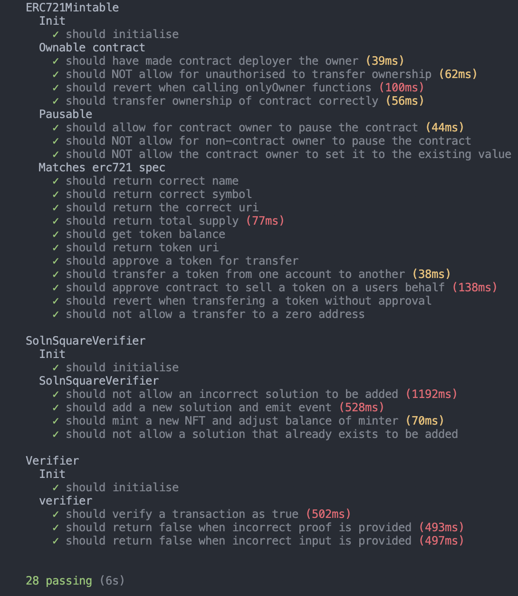

# Capstone Project 

 

# Decentralised Property Listing Application 

 

## Overview

 

### The Project
- This project is a proof of property ownership layer which tokenises a users title to a property. Before a user mints a token, they must verify the ownership of a property. In order to do this, zk-SNARKS has been implemented to create a verification system. This system proves that the user has their title to the property without revealing specific/sensitive information about the property. 

### zkSNARKs
- zkSNARKs (Zero Knowledge, Succinct, Non-Interactive Argument of Knowledge) allows you to verify, with cryptographic certainty, that someone else has computed a value and that they’ve done so by a process which you can verify all without having to witness the actual computation. Its a way to quickly prove something, without interacting with anyone else, in a way that is difficult to hack, can’t be replicated, and can be done without you needing to tell anyone what you’re trying to prove.  

- In this project, zkSNARKs has been implemented using ZoKrates, a toolbox for zkSNARKs on Ethereum. ZoKrates provides a higher level programming language which compiles down to the underlying constraint system and thus allows programmers to write snarks much closer to how they are used to programming. Docker has also been used to intialise and setup ZoKrates. 

### OpenSea
- Property tokens are listed on OpenSea, a decentralised marketplace used for selling digital assets on Ethereum. 

 

# Deployed Contracts

# Smart Contracts and Testing
<!--  -->

 

### Smart Contracts 
- `ERC721Mintable.sol`
- `ProvableAPI.sol`
- `SolnSquareVerifier`
- `Verifier.sol`

### Testing
- Test cases have been written in TypeScript.
- [Chai](https://www.chaijs.com/): BDD / TDD assertion library for node.
- [Mocha](https://mochajs.org/): JS test framework running on Node.js and in the browser for asynchronous testing.
- [Waffle](https://ethereum-waffle.readthedocs.io/en/latest/index.html): Library for writing and testing smart contracts.
- [Hardhat plugins](https://hardhat.org/plugins/nomiclabs-hardhat-ethers.html): hardhat/ethers (plugin for integration with ethers.js). 
 

### Dev Libraries and Tools
- [React.js](https://reactjs.org/): (create-react-app) a free and open-source front-end JavaScript library for building user interfaces based on UI components.
- [Hardhat](https://hardhat.org/): Ethereum development environment.
- [ethers.js](https://docs.ethers.io/v5/): JS/TS library for interacting with the Ethereum blockchain and its ecosystem.
- [OpenZeppelin](https://openzeppelin.com/): provides security products to build, automate, and operate decentralized applications.
- [Docker](https://www.docker.com/)
- [ZoKrates](https://zokrates.github.io/)

 

# Generating Proof from ZoKrates
1. Navigate to project folder: `cd CapstoneV2/my-app/zokrates/code/`

2. Make sure Docker is running

3. Run the ZoKrates docker image: `docker run -v <path to your project folder>:/home/zokrates/code -ti zokrates/zokrates /bin/bash`

4. `cd code/square`

5. Compile the program `zokrates compile -i square.code`

6. Generate the trusted setup `zokrates setup`

7. Compute witness for your chosen pair of numbers. The project already contains proof for [3,9] so replace 3 9 for two different numbers. `zokrates compute-witness -a 3 9`

8. Generate proof `zokrates generate-proof`

9. Export verifier.sol `zokrates export-verifier`

10. Generated Files are: `abi.json out proof.json proving.key verification.key verifier.sol witness`

